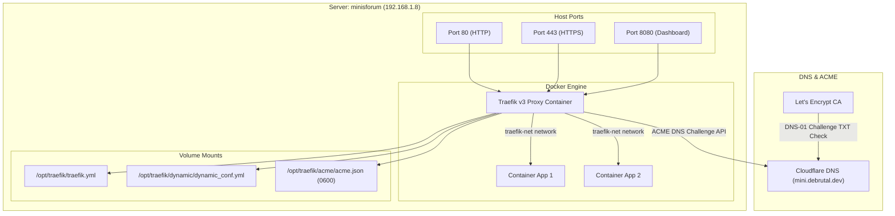

# Introduction & Architecture Overview

Welcome to the **Minisforum Infra Developer Guide**. This repository contains the automated infrastructure-as-code (IaC) configuration for the target server (`minisforum` at `192.168.1.8`).

## Purpose & Scope

The goal of this project is to provide deterministic, idempotent, and testable provisioning of core server tools and infrastructure services:
- **Base Utilities**: Essential system tooling (`git`, `jq`, `curl`, `wget`, `ca-certificates`).
- **Development Editor**: Modern binary installation of Neovim (`nvim`).
- **Container Runtime**: Docker Engine (`docker-ce`) and Docker Compose (`docker-compose-plugin`).
- **Reverse Proxy & Edge Ingress**: Traefik v3 reverse proxy supporting automatic wildcard TLS certificate issuance via ACME DNS-01 challenges (`*.mini.debrutal.dev`).

## Infrastructure Topology

The diagram below illustrates how external and internal traffic flows through Traefik into containerized services:

## Key Architectural Principles

1. **Idempotence**: Every Ansible role can be executed repeatedly without unnecessary changes or side effects.
2. **Containerized Ingress**: All public/private web applications are routed through Traefik using Docker container labels.
3. **Automated TLS**: Wildcard certificates (`*.mini.debrutal.dev`) are managed automatically via Let's Encrypt DNS-01 challenge solving.
4. **Three-Tier Testing**: Full test coverage across Static Analysis, Molecule Integration lifecycle, and Testinfra System Verification.
