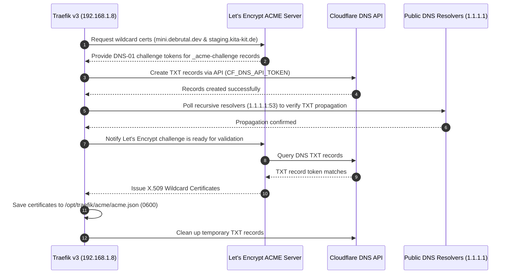

# Traefik & ACME DNS-01 Setup

This chapter explains how Traefik is configured to route ACME DNS-01 challenges for wildcard domain certificates (`*.mini.debrutal.dev` and `*.staging.kita-kit.de`).

## Why DNS-01 Challenge for Wildcards?

Under the ACME specification (RFC 8555 / Let's Encrypt), **HTTP-01 challenges cannot issue wildcard domain certificates** (`*.domain.com`). To obtain certificates that cover `mini.debrutal.dev` and `*.mini.debrutal.dev`, as well as private staging subdomains (`staging.kita-kit.de` and `*.staging.kita-kit.de`), Traefik proves domain control using the **DNS-01 challenge**.

Because staging is local to the private network (192.168.1.8), Let's Encrypt cannot reach the host over public HTTP. Traefik running locally manages the DNS entries (`_acme-challenge`) via Cloudflare's API using the same DNS token.

## Architecture & Data Flow



## Traefik Static Configuration (`traefik.yml.j2`)

```yaml
entryPoints:
  web:
    address: ":80"
    # ...
  websecure:
    address: ":443"
    http:
      # ...
      tls:
        certResolver: letsencrypt
        domains:
          - main: "mini.debrutal.dev"
            sans:
              - "*.mini.debrutal.dev"
          - main: "staging.kita-kit.de"
            sans:
              - "*.staging.kita-kit.de"

certificatesResolvers:
  letsencrypt:
    acme:
      email: "{{ traefik_acme_email }}"
      storage: "/etc/traefik/acme/acme.json"
      dnsChallenge:
        provider: cloudflare
        resolvers:
          - "1.1.1.1:53"
          - "1.0.0.1:53"
```

## Container Environment & Compose (`docker-compose.yml.j2`)

```yaml
services:
  traefik:
    image: traefik:v3.7.13
    container_name: traefik
    restart: always
    environment:
      - "CF_DNS_API_TOKEN=your-cloudflare-api-token-here"
    volumes:
      - /var/run/docker.sock:/var/run/docker.sock:ro
      - /opt/traefik/traefik.yml:/etc/traefik/traefik.yml:ro
      - /opt/traefik/dynamic:/etc/traefik/dynamic:ro
      - /opt/traefik/acme/acme.json:/etc/traefik/acme/acme.json
    labels:
      - "traefik.enable=true"
      - "traefik.http.routers.traefik_api.rule=Host(`traefik.local`) || Host(`traefik.mini.debrutal.dev`) || Host(`dashboard.mini.debrutal.dev`) || Host(`traefik.staging.kita-kit.de`)"
      - "traefik.http.routers.traefik_api.service=api@internal"
      - "traefik.http.routers.traefik_api.entrypoints=websecure"
      - "traefik.http.routers.traefik_api.tls=true"
      - "traefik.http.routers.traefik_api.tls.certresolver=letsencrypt"
      - "traefik.http.routers.traefik_api.tls.domains[0].main=mini.debrutal.dev"
      - "traefik.http.routers.traefik_api.tls.domains[0].sans=*.mini.debrutal.dev"
      - "traefik.http.routers.traefik_api.tls.domains[1].main=staging.kita-kit.de"
      - "traefik.http.routers.traefik_api.tls.domains[1].sans=*.staging.kita-kit.de"
```

## Dynamic TLS Store (`dynamic_conf.yml.j2`)

```yaml
tls:
  stores:
    default:
      defaultGeneratedCert:
        resolver: letsencrypt
        domain:
          main: "mini.debrutal.dev"
          sans:
            - "*.mini.debrutal.dev"
```

This configuration ensures that any proxied HTTP router under `*.mini.debrutal.dev` or `*.staging.kita-kit.de` automatically receives valid Let's Encrypt TLS certificates generated via DNS challenge!
