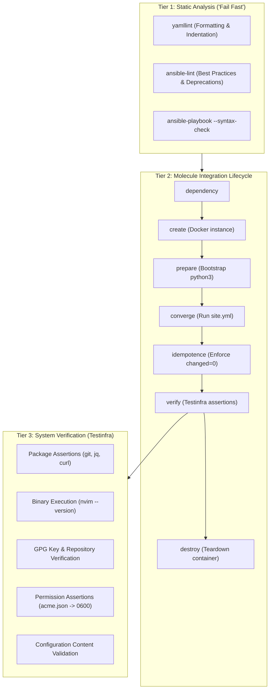

# Testing & Quality Assurance

This chapter describes the 3-tier testing architecture implemented to guarantee code quality, syntax correctness, role idempotence, and system state verification.

## Testing Architecture Overview



## 1. Static Analysis (The "Fail Fast" Layer)
Before executing code, static analysis validates YAML syntax and enforces Ansible best practices:
- **`yamllint`**: Enforces strict YAML rules (`.yamllint`).
- **`ansible-lint`**: Checks playbooks and roles against Ansible community guidelines (`.ansible-lint`).
- **`ansible-playbook --syntax-check`**: Native syntax validation.

### Execution Command:
```bash
yamllint .
ansible-lint
ansible-playbook site.yml --syntax-check
```

## 2. Molecule (Integration Testing Standard)
Molecule automates role testing through an isolated Docker container lifecycle:
1. **Dependency**: Pulls Galaxy requirements (`community.docker`, `ansible.posix`).
2. **Create**: Provisions an `ubuntu:latest` test container (`instance`).
3. **Prepare**: Installs `python3` inside the container.
4. **Converge**: Applies `site.yml` against the container.
5. **Idempotence**: Runs `site.yml` a second time and asserts `changed=0`.
6. **Verify**: Executes Testinfra assertions.
7. **Destroy**: Deletes the temporary container.

### Execution Command:
```bash
export PATH="$PWD/.venv/bin:$PATH"
molecule test
```

## 3. System Verification (Testinfra)
Testinfra (`pytest-testinfra`) verifies actual filesystem and process state inside the container post-deployment (`molecule/default/tests/test_default.py`).

### Verifications Performed:
- **Packages**: `git`, `jq`, `curl`, `ca-certificates` installed.
- **Neovim**: `/usr/local/bin/nvim` executable and version returns `NVIM v...`.
- **Docker**: `/etc/apt/keyrings/docker.asc` exists.
- **Traefik Configs**: `traefik.yml` contains `dnsChallenge` with `cloudflare`; `docker-compose.yml` contains `CF_DNS_API_TOKEN` and domain rules; `dynamic_conf.yml` contains default TLS store for `*.mini.debrutal.dev`.

- **Permissions**: `/opt/traefik/acme/acme.json` permissions are strictly `0600`.

## Unified Test Runner

Run all 3 tiers with a single command:
```bash
./tests/run_tests.sh
```
