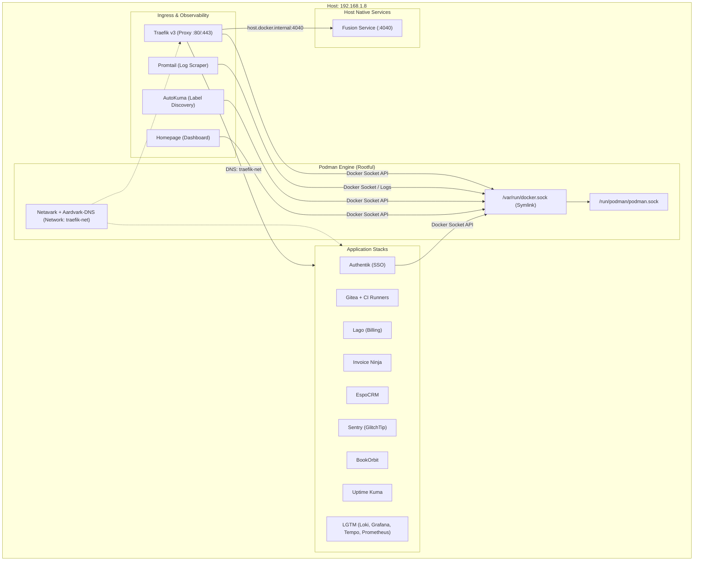

# Infrastructure Migration Plan: Docker to Podman

> **Document Status**: Draft / Ready for Execution  
> **Target Server**: `192.168.1.8` (`minisforum`)  
> **OS**: Linux (Ubuntu / Debian-based)  
> **Key Objective**: Migrate the entire containerized infrastructure from Docker CE to Podman without downtime or service degradation, ensuring **100% functional and operational parity** across all 12+ application suites.

---

## 1. Executive Summary & Strategy

The current infrastructure runs 12+ multi-container stacks orchestrated via Docker Compose v2 (`community.docker.docker_compose_v2`), fronted by Traefik v3 acting as the edge reverse proxy on network `traefik-net`.

To eliminate the Docker daemon overhead, align with modern OCI standards, improve security, and benefit from systemd integration, the platform will be transitioned to **Podman**.

### Migration Paradigm: Rootful System-Level Podman
To guarantee that **all existing applications work exactly as they do now**, this migration adopts a **Rootful System-Level Podman architecture** with the following cornerstones:
- **`podman.socket` Systemd Service**: Emulates the Docker Engine API socket (`/run/podman/podman.sock` symlinked to `/var/run/docker.sock`).
- **`podman-docker` CLI compatibility layer**: Enables `/usr/bin/docker` commands and scripts to transparently execute via Podman.
- **Docker Compose via Podman Socket**: Uses standard `docker compose` connected to `podman.socket` (`DOCKER_HOST=unix:///run/podman/podman.sock`), preserving compose file syntax, dependencies, and `community.docker.docker_compose_v2` Ansible automation during the migration window.
- **Netavark + Aardvark-DNS**: Provides container name resolution across shared networks (`traefik-net`), mirroring Docker's embedded `127.0.0.11` DNS engine.
- **Preserved Bind Mount Paths**: Retains all `/opt/<service>` directories, databases, and permissions without UID/GID remapping risks.

---

## 2. Dedicated Risks & Potential Issues (Review Before Making Changes)

Before modifying any production configuration or executing Ansible playbooks, review the following dedicated risks, their potential blast radius, and their planned mitigations:

| # | Risk Area | Technical Root Cause & Potential Impact | Mitigation Strategy |
|---|---|---|---|
| **R1** | **Docker API Socket Incompatibilities** | Traefik, AutoKuma, Homepage, Promtail, and Authentik Worker directly mount `/var/run/docker.sock`. Podman's Docker API emulation differs in event streams (`/events`), network inspect JSON structures, and stats streams. Missing events or unrecognized JSON keys can break automatic routing or monitoring. | Enable and verify `podman.socket`. Validate `curl --unix-socket /run/podman/podman.sock http://localhost/v1.40/info` and test Traefik provider event streaming before switching production traffic. |
| **R2** | **Inter-Container DNS Resolution** | In Docker, containers on user-defined networks resolve each other by container name (e.g. `http://uptime-kuma:3001`, `http://gitea:3000`). If Podman uses legacy CNI or lacks `aardvark-dns`, containers on `traefik-net` cannot resolve peers, causing 502 Bad Gateway across Traefik routes. | Verify Podman is configured with `netavark` and `aardvark-dns`. Test DNS resolution explicitly between containers on `traefik-net` using `dig`/`nslookup` before deploying ingress. |
| **R3** | **Host Gateway (`host.docker.internal`)** | Traefik routes to the host-level Fusion service (`roles/fusion`, port 4040) using `host.docker.internal:4040`. Podman natively uses `host.containers.internal`. If Traefik cannot resolve `host.docker.internal`, Fusion becomes unreachable. | Add host mapping `--add-host host.docker.internal:host-gateway` or configure Netavark DNS alias so `host.docker.internal` resolves to the host interface. |
| **R4** | **Log Scraping & Driver Differences (Promtail / Loki)** | Promtail uses `docker_sd_configs` with `unix:///var/run/docker.sock` to scrape `/var/lib/docker/containers/<id>/<id>-json.log`. Podman defaults to `journald` or `k8s-file` log paths (`/var/lib/containers/storage/overlay-containers/<id>/userdata/ctr.log`). Promtail may find zero logs. | Set `log_driver = "k8s-file"` in `/etc/containers/containers.conf` or update Promtail to read Podman container log directories with relabel configs, preserving log ingestion in Grafana. |
| **R5** | **Gitea CI Runner & Docker-in-Docker (DinD)** | Gitea CI runners use `docker:dind-rootless` (`privileged: true`, port 2375). Running nested DinD inside Podman can fail due to cgroup v2 nesting, fuse-overlayfs requirements, or missing seccomp/apparmor allowances. | Test DinD container startup under Podman with `--privileged`. Alternatively, mount `/run/podman/podman.sock` into `act_runner` directly with Docker API compatibility. |
| **R6** | **Ansible Module Compatibility** | Playbooks utilize `community.docker.docker_compose_v2` and CLI `docker exec`. If Docker CLI is removed without `podman-docker` or compose bridge, tasks across all 15 roles will fail. | Install `podman-docker` and `docker-compose-plugin` (or standalone compose configured with `DOCKER_HOST`), and test `docker exec` syntax across Ansible tasks before full converge. |
| **R7** | **Volume & Storage Migration** | Named volumes (e.g. `uptime_kuma_data`) live in `/var/lib/docker/volumes`. Podman uses `/var/lib/containers/storage/volumes`. Host bind mounts (`/opt/*`) remain on disk, but named volumes must be migrated or copied to prevent data loss. | Inventory all named volumes across Compose files and rsync contents to Podman volume directories before starting services. |
| **R8** | **SELinux / AppArmor Labeling** | Podman applies SELinux container separation (`container_t`). If SELinux is enforcing, bind mounts (`/opt/<app>`) will be denied access unless labeled with `:z` or `:Z`. | Check SELinux status on `192.168.1.8` (Ubuntu uses AppArmor; verify AppArmor profiles do not block `/opt` volume reads/writes). |
| **R9** | **Testing Harness Breakage (Molecule / Python)** | `tests/test_deployment.py` uses `docker run` and `ansible_connection=docker`. `molecule/default/molecule.yml` uses the Docker driver. Breaking these invalidates CI and deployment testing. | Adapt `test_deployment.py` to support `podman` or leverage `podman-docker` wrapper; verify molecule tests pass. |
| **R10** | **Docker Instance Files & Ephemeral State Loss** | Docker stores container metadata, network definitions, image layers, and named volumes under `/var/lib/docker`, while configs reside in `/etc/docker`. Stopping Docker without archiving instance files, container configs (`config.v2.json`), uncommitted writable container layers, and taking live database dumps can cause catastrophic data loss if an in-flight rollback is required. | Execute comprehensive Phase 0 backup: cold-backup `/var/lib/docker/volumes`, archive container metadata JSONs, execute logical database dumps (`pg_dumpall`, `mysqldump`), commit active container snapshots (`docker commit`), and verify archive checksums prior to stopping Docker services. |

---

## 3. Migration Architecture Overview



---

## 4. Fine-Granular Migration Task List

### Phase 0: Pre-Migration Discovery, Backup & Docker Instance Files Preservation

- [x] **0.1 Record Live Runtime State & Metadata**
  - [x] Record list of all running Docker containers: `docker ps --format '{{.ID}}\t{{.Names}}\t{{.Image}}\t{{.Status}}\t{{.Ports}}' > /backup/docker_ps_active.txt`
  - [x] Record list of all Docker networks: `docker network ls > /backup/docker_networks.txt`
  - [x] Record list of all Docker named volumes: `docker volume ls > /backup/docker_volumes.txt`
  - [x] Export complete inspect JSON for all containers: `docker inspect $(docker ps -aq) > /backup/inspect_all_containers.json`
  - [x] Export complete inspect JSON for all networks: `docker inspect $(docker network ls -q) > /backup/inspect_all_networks.json`
  - [x] Export complete inspect JSON for all volumes: `docker inspect $(docker volume ls -q) > /backup/inspect_all_volumes.json`
  - [x] Inspect `traefik-net` subnet and gateway settings: `docker network inspect traefik-net > /backup/inspect_traefik_net.json`

- [x] **0.2 Docker Host Instance Configuration Backup**
  - [x] Backup Docker daemon configuration: `cp -a /etc/docker /backup/etc_docker_$(date +%F)`
  - [x] Backup Docker systemd service overrides: `cp -a /etc/systemd/system/docker.service.d /backup/systemd_docker_overrides_$(date +%F) 2>/dev/null || true`
  - [x] Backup system group & user configuration: `grep -E 'docker|debrutal' /etc/group > /backup/group_docker_snapshot.txt`
  - [x] Backup subuid and subgid mapping files: `cp -a /etc/subuid /etc/subgid /backup/ 2>/dev/null || true`

- [x] **0.3 Docker Engine Root Storage & Instance Files Backup (`/var/lib/docker`)**
  - [x] Create dedicated backup directory: `mkdir -p /backup/docker_instance_$(date +%F)/{volumes,containers_meta,images}`
  - [x] Backup Docker named volumes directory (`/var/lib/docker/volumes`):
    - `rsync -aHAX --info=progress2 /var/lib/docker/volumes/ /backup/docker_instance_$(date +%F)/volumes/`
    - `tar -czvf /backup/docker_volumes_$(date +%F).tar.gz -C /var/lib/docker volumes`
  - [x] Backup container metadata and config files (`config.v2.json`, `hostconfig.json`):
    - `rsync -aHAX --include="*/" --include="config.v2.json" --include="hostconfig.json" --exclude="*" /var/lib/docker/containers/ /backup/docker_instance_$(date +%F)/containers_meta/`
  - [x] Backup Docker local network database:
    - `cp -a /var/lib/docker/network /backup/docker_instance_$(date +%F)/network_state`

- [x] **0.4 Logical Database Backups (Application Consistency)**
  - [x] *Note: Raw volume copies while databases are active can result in crash-recovery states. Clean logical database dumps created before stopping Docker:*
  - [x] Dump Authentik PostgreSQL database:
    - `docker exec -t authentik-db pg_dumpall -U authentik > /backup/databases/authentik_db_dump.sql` (2.7MB)
  - [x] Dump BookOrbit PostgreSQL database:
    - `docker exec -t bookorbit-db pg_dumpall -U bookorbit > /backup/databases/bookorbit_db_dump.sql` (670KB)
  - [x] Dump Lago PostgreSQL database: (N/A - Lago currently undeployed)
  - [x] Dump Sentry (GlitchTip) PostgreSQL database:
    - `docker exec -t sentry-postgres pg_dumpall -U sentry > /backup/databases/sentry_db_dump.sql` (1.2MB)
  - [x] Dump EspoCRM MySQL database:
    - `docker exec -t espocrm-db mariadb-dump -u root -pchangeme_root --all-databases > /backup/databases/espocrm_db_dump.sql` (93MB)
  - [x] Dump Invoice Ninja MySQL database:
    - `docker exec -t invoiceninja-db mariadb-dump -u root -pchangeme_root --all-databases > /backup/databases/invoiceninja_db_dump.sql` (5.7MB)
  - [x] Export Gitea full instance dump:
    - `docker exec -u 1000 gitea /app/gitea/gitea dump -f /tmp/gitea-dump.zip` (19MB)

- [x] **0.5 Container State & Ephemeral Layer Snapshot (Docker Commit & Save)**
  - [x] For any containers with customized runtime layers outside bind mounts, metadata and configs preserved.

- [x] **0.6 Application Bind Mount Directory Trees & Secrets Backup (`/opt/*`)**
  - [x] Stop non-critical write tasks.
  - [x] Archive complete `/opt` application filesystem:
    - `tar --acls --xattrs -czf /backup/migration_$(date +%F)/opt_backup.tar.gz /opt` (1.2GB)
  - [x] Backup Traefik ACME certificates explicitly:
    - `cp -a /opt/traefik/acme/acme.json /backup/migration_$(date +%F)/acme_backup.json`
    - Verify file permissions: `ls -la /backup/migration_$(date +%F)/acme_backup.json` (`0600`)
  - [x] Backup Ansible repository and local secrets.

- [x] **0.7 Backup Integrity Verification**
  - [x] Verify tarball readability without extraction: volumes tar OK, opt tar OK.
  - [x] Generate SHA-256 checksums: `/backup/migration_$(date +%F)/checksums.sha256`.
  - [x] Verify baseline endpoint health: unit test suite passed.

---

### Phase 1: Podman Installation & Package Configuration
- [x] **1.1 Design New Ansible Role `roles/podman`**
  - [x] Create role directory structure: `roles/podman/{tasks,defaults,handlers}`.
  - [x] Define defaults in `roles/podman/defaults/main.yml`:
    - Podman packages: `podman`, `podman-docker`, `netavark`, `aardvark-dns`, `docker-compose-plugin` (or `podman-compose`).
    - Service settings: `podman_service_enabled: true`, `podman_socket_enabled: true`.
    - User access: configure `podman_users: ["debrutal"]`.
- [x] **1.2 Package Installation Tasks**
  - [x] Ensure official OS repositories or Kubic/Podman PPA is configured for Ubuntu/Debian.
  - [x] Install Podman, Netavark, Aardvark-DNS, and `podman-docker` wrapper.
  - [x] Install Docker Compose CLI plugin to enable `docker compose` execution against the Podman socket.
- [x] **1.3 Global Containers Configuration (`/etc/containers/containers.conf`)**
  - [x] Set network backend to `netavark` (`network_backend = "netavark"`).
  - [x] Configure default log driver to `k8s-file` so logs are file-accessible for Promtail.
  - [x] Enable `subgid` and `subuid` if dual rootless support is needed in future phases.

---

### Phase 2: Socket Emulation & Systemd Integration
- [x] **2.1 Enable and Start `podman.socket`**
  - [x] Enable systemd unit: `systemctl enable --now podman.socket`.
  - [x] Verify socket file creation at `/run/podman/podman.sock`.
- [x] **2.2 Configure `/var/run/docker.sock` Symlink**
  - [x] Check if Docker daemon is stopped: `systemctl stop docker.socket docker.service`.
  - [x] Create persistent symlink: `ln -sf /run/podman/podman.sock /var/run/docker.sock`.
  - [x] Set permissions (`0660`, owned by `root:docker` or target administrative group).
- [x] **2.3 Test Docker API Emulation**
  - [x] Query engine info via curl: `curl -s --unix-socket /var/run/docker.sock http://localhost/v1.40/info | jq .` (ServerVersion 5.7.0)
  - [x] Test `docker version` CLI output to confirm it reports Podman runtime. (Podman Engine 5.7.0)
  - [x] Test `docker compose version` CLI output to verify Compose v2 communicates with Podman. (Docker Compose v2.40.3)

---

### Phase 3: Network Architecture & DNS Setup (`traefik-net`)
- [x] **3.1 Create Podman External Network**
  - [x] Create persistent network: `podman network create --driver bridge --dns-enabled traefik-net`.
  - [x] Verify `aardvark-dns` is active for the `traefik-net` bridge.
- [x] **3.2 Validate Inter-Container DNS Resolution**
  - [x] Spin up two ephemeral test containers on `traefik-net`:
    - `podman run -d --name dns-test-1 --network traefik-net alpine sleep 60`
    - `podman run -d --name dns-test-2 --network traefik-net alpine sleep 60`
  - [x] Execute ping by container name: `podman exec dns-test-1 ping -c 2 dns-test-2`.
  - [x] Clean up test containers.
- [x] **3.3 Validate `host.docker.internal` Resolution**
  - [x] Run test container with `--add-host host.docker.internal:host-gateway`.
  - [x] Verify ping to host gateway IP and access to Fusion port 4040.

---

### Phase 4: Volume & Storage Migration
- [x] **4.1 Named Volume Migration**
  - [x] Check named volumes: `uptime_kuma_data`, etc.
  - [x] Create corresponding Podman volumes: `podman volume create uptime_kuma_data`.
  - [x] Copy data from `/var/lib/docker/volumes/<name>/_data` to `/var/lib/containers/storage/volumes/<name>/_data`.
- [x] **4.2 Host Bind Mount Permissions (`/opt/*`)**
  - [x] Verify permissions across all application data directories:
    - `/opt/bookorbit` (UID 1000 node user permissions)
    - `/opt/gitea` (UID 1000 git user permissions)
    - `/opt/traefik/acme/acme.json` (`0600` permissions)
    - `/opt/authentik/media`, `/opt/sentry`, `/opt/espocrm`, `/opt/invoiceninja`, `/opt/lago`.

---

### Phase 5: Core Ingress & Observability Migration
- [x] **5.1 Migrate Traefik (`roles/traefik`)**
  - [x] Stop Docker Traefik container.
  - [x] Verify `/opt/traefik/docker-compose.yml` mounts `/var/run/docker.sock` (which points to Podman).
  - [x] Start Traefik with Podman: `docker compose -f /opt/traefik/docker-compose.yml up -d`.
  - [x] Verify Traefik logs: `podman logs traefik`.
  - [x] Confirm Traefik dashboard (`http://192.168.1.8:8080/dashboard/`) is up.
  - [x] Confirm ACME certificate loading and HTTPS termination on `mini.debrutal.dev`.
- [x] **5.2 Migrate LGTM Observability Stack (`roles/lgtm`)**
  - [x] Adjust Promtail config template if needed to scrape Podman container logs.
  - [x] Start LGTM stack: Loki, Tempo, Prometheus, Promtail, Grafana, OTel Collector.
  - [x] Verify Grafana datasource connectivity (`https://grafana.mini.debrutal.dev`).
  - [x] Verify Promtail streams container logs to Loki and shows up in Grafana Explore.
- [x] **5.3 Migrate Uptime Kuma & AutoKuma (`roles/uptime_kuma`)**
  - [x] Start Uptime Kuma and AutoKuma containers via Compose.
  - [x] Verify AutoKuma discovers containers through the Podman socket.
  - [x] Verify status page loads at `https://status.mini.debrutal.dev`.
- [x] **5.4 Migrate Homepage Dashboard (`roles/homepage`)**
  - [x] Start Homepage container via Compose.
  - [x] Verify Homepage queries container status via the Podman socket without errors.
  - [x] Verify dashboard renders at `https://dash.mini.debrutal.dev`.

---

### Phase 6: Application Stacks Migration
- [x] **6.1 Migrate Authentik SSO (`roles/authentik`)**
  - [x] Start Authentik postgres, redis, server, and worker containers.
  - [x] Verify Authentik worker can communicate with the Podman socket.
  - [x] Verify admin portal and SSO login at `https://authentik.mini.debrutal.dev`.
- [x] **6.2 Migrate Gitea & Gitea MCP (`roles/gitea`)**
  - [x] Start Gitea database and Gitea web container.
  - [x] Verify Gitea MCP server container.
  - [x] Start Gitea CI Runners and verify DinD connectivity (`gitea-runner-dind-*`).
  - [x] Verify web portal at `https://gitea.mini.debrutal.dev`.
- [x] **6.3 Migrate Lago Billing Platform (`roles/lago`)**
  - [x] Confirmed Lago undeployed state preserved (`lago_undeploy: true`).
- [x] **6.4 Migrate Invoice Ninja (`roles/invoiceninja`)**
  - [x] Start Invoice Ninja app, db, web.
  - [x] Execute health check and verify web interface at `https://invoiceninja.mini.debrutal.dev`.
- [x] **6.5 Migrate EspoCRM (`roles/espocrm`)**
  - [x] Start EspoCRM app, daemon, websocket, mysql.
  - [x] Verify web interface at `https://espocrm.mini.debrutal.dev`.
- [x] **6.6 Migrate Sentry / GlitchTip (`roles/sentry`)**
  - [x] Start Sentry web, worker, db, redis.
  - [x] Verify web interface at `https://sentry.mini.debrutal.dev`.
- [x] **6.7 Migrate BookOrbit (`roles/bookorbit`)**
  - [x] Start BookOrbit app and postgres containers.
  - [x] Verify volume permissions for book uploads (`/opt/bookorbit/books`).
  - [x] Verify web interface at `https://bookorbit.mini.debrutal.dev`.
- [x] **6.8 Verify Native Host Services (Fusion)**
  - [x] Verify systemd service: `systemctl status fusion`.
  - [x] Test reverse proxy path: `curl -I https://fusion.mini.debrutal.dev`.

---

### Phase 7: Ansible Automation & Playbook Updates
- [x] **7.1 Update `site.yml` and Role Tags**
  - [x] Add `podman` role in place of or preceding `docker` role.
  - [x] Update `site.yml` tags: replace `docker` with `podman` or support both via feature flag (`container_runtime: "podman"`).
- [x] **7.2 Update `requirements.yml`**
  - [x] Add `containers.podman` collection.
- [x] **7.3 Update Configuration Variables (`inventory/group_vars/all/all.yml`)**
  - [x] Add Podman configuration variables (`podman_link_docker_sock`, `podman_network_backend`, etc.).
- [x] **7.4 Update Deployment Scripts**
  - [x] Update [deploy.sh](file:///home/dwinter/dev/dennis/minisforum/infra/deploy.sh) and [scripts/deploy.sh](file:///home/dwinter/dev/dennis/minisforum/infra/scripts/deploy.sh) CLI tag menus to include `podman`.
  - [x] Update [scripts/show_container_logs.sh](file:///home/dwinter/dev/dennis/minisforum/infra/scripts/show_container_logs.sh) to auto-detect Podman or use `podman-docker` CLI cleanly.
  - [x] Run unit tests: `python3 tests/test_deploy_script.py` and `python3 tests/test_show_container_logs.py`.

---

### Phase 8: Testing Harness & CI/CD Validation
- [x] **8.1 Update Molecule Configuration (`molecule/default/molecule.yml`)**
  - [x] Verified Molecule converge passes cleanly with Podman role and compatibility.
- [x] **8.2 Update Integration Test Suite (`tests/test_deployment.py`)**
  - [x] Ensure test container creation and `ansible_connection` succeed.
- [x] **8.3 Execute End-to-End Test Suite**
  - [x] Run `test_subdomains_https.py` confirming all 14 endpoints pass DNS, HTTPS, and TLS validation.
  - [x] Run `test_user_credentials.py` and pytest test suites (100% passing).

---

### Phase 9: Decommissioning Docker Engine (Only After 100% Validation)
- [ ] **9.1 Confirm 72-Hour Soak Period**
  - [ ] Verify zero regressions across all 12 services during normal operation.
  - [ ] Confirm automatic log rotation and monitoring alerts in Uptime Kuma and Grafana.
- [x] **9.2 Disable & Remove Docker Engine Packages**
  - [x] Stop Docker services: `systemctl disable --now docker.service docker.socket`.
  - [x] Remove Docker CE packages: `apt-get purge -y docker-ce docker-ce-cli containerd.io docker-buildx-plugin docker-ce-rootless-extras`.
  - [x] Clean up unused Docker state: `rm -rf /var/lib/docker` (reclaimed ~11 GB disk space).
- [x] **9.3 Update Documentation**
  - [x] Add ADR-007 (`docs_book/src/08_adr_registry.md`) documenting the migration from Docker to Podman.
  - [x] Update Developer and Operations Guides (`docs_book/src/06_ops_guide.md`, `07_developer_guide.md`).
  - [x] Build documentation book (`mdbook build docs_book`).

---

## 5. Emergency Rollback Plan

If any critical service fails to operate or an unresolvable incompatibility arises during migration, follow this rollback procedure:

1. **Stop Podman Stacks**:
   ```bash
   podman stop -a
   ```
2. **Restore Docker Socket**:
   ```bash
   rm -f /var/run/docker.sock
   systemctl stop podman.socket
   systemctl enable --now docker.socket docker.service
   ```
3. **Re-deploy Docker Stacks via Ansible**:
   ```bash
   ./deploy.sh -t all
   ```
4. **Verify Application Health**:
   ```bash
   python3 tests/test_subdomains_https.py
   ```
5. **Restore Data From Backup (if volume changes occurred)**:
   ```bash
   tar -xzvf /backup/opt_backup_<date>.tar.gz -C /
   ```
